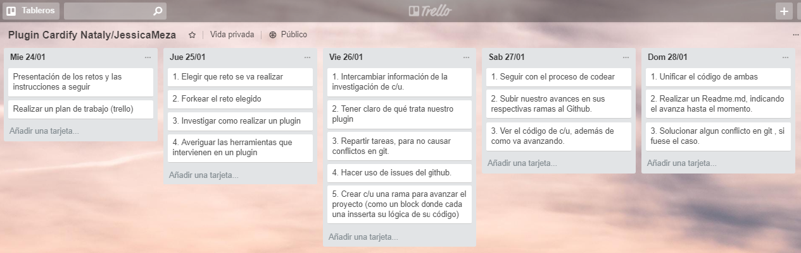
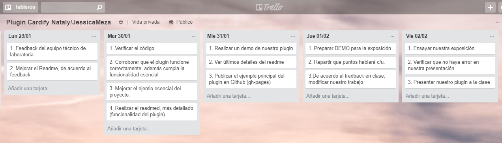
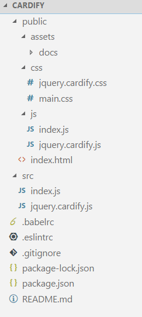
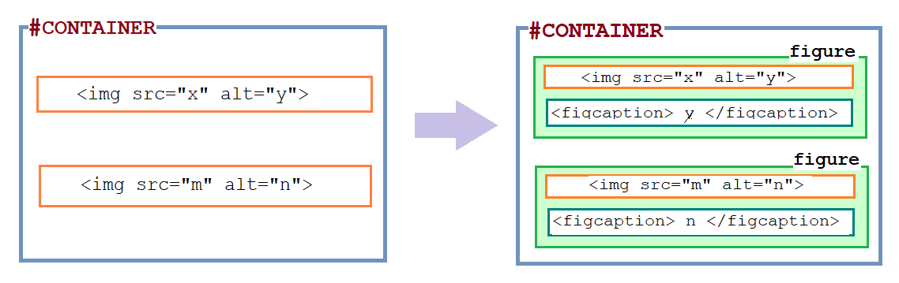

# Cardify
Realizar un plugin que permita mostrar el atributo `alt` de la imagen al hacer el efecto _hover_.


## Desarrollado para [Laboratoria](http://www.laboratoria.la/)

## Elaborado por:

* Jessica Meza

******

### Reto-Laboratoria

* Duración: 10 días

## Introducción
El contenido de este `Readme.md`, está destinado a presentar de una forma sencilla la planificación, el desarrollo y resultado de nuestro plugin _Cardify_. Es decir dejar listo para que otros desarrolladores puedan seguir construyendo sus propias extensiones a partir de nuestro código.

## Objetivos

* Lograr la funcionalidad del plugin.
* Realizar un _DEMO_, con un ejemplo principal de uso.

## Etapa de planificación

Para está etapa, usamos la herramienta _trello_, facilitando la organización de tareas.




## Etapa de desarrollo

### 1. Herramientas:

* __HTML5__
* __CSS3__
* __jQuery-3__
* __Bootstrap 4.0__ (usado solo en el demo, mas no en el plugin).
* La sintaxis de nuestro código está en ECMAScript 6 (ES-6), sin embargo no todos los navegadores permite leerlo, por ello utilizamos __BABEL__, para transformar la sintaxis del código de ES-6 a ES-5.

### 2. Archivos importantes dentro de la estructura del proyecto:

* __README.md__, descripción del pluggin, instrucciones de instalación, uso y documentación del API.
* __jquery.cardify.js__: librería a exportar una función u objeto al entorno global (window)
* __index.html__: página web de la librería con ejemplo.
* __package.json__: con nombre, versión, descripción, autores, licencia, dependencias, scripts (pretest, test, ...)
* __.eslintrc__: es una guía de estilo de JavaScript.
* __.gitignore__: para ignorar archivos que no deban incluirse en control de versiones (git).
* __.babelrc__: transformar la sintaxis del código de ES-6 a ES-5.

En la siguiente imagen es una referencia de la estructura de carpetas de los archivos.



### 3. Código JavaScript del Plugin: 

 ```js
(function($) {
  $.fn.extend({ 
	  cardify: function() {  
      let container = $('#container');
      container.find('img')
        .each(function() {     	           
          $(this).wrap('<figure class="image-frame"></figure>');
          $(this).after('<figcaption class="image-caption">' + $(this).attr('alt') + '</figcaption>');       
        });  
      $('.image-frame').hover(function() {
        $('.image-caption', this).slideToggle('slow');
      }, function() {
        $('.image-caption', this).slideToggle('slow');
      });
	  }  
  });
})(jQuery);

 ```
### 4. Código CSS del Plugin: 

 ```css
img {
  width: 100%;
}
.image-frame {
  overflow: hidden;
  position: relative;
}

.image-caption {
  display: none;
  height: 100%;
  width: 100%;
  position: absolute;
  bottom: 0px;
  text-align: center;
  font-size:1.5em;
  background-color: rgba(15, 15, 15, 0.6);
  color: #fff;
}
 ```
## Presentación del plugin _CARDIFY_ versión 1.0.0:

> Cardify es un plugin de jQuery liviano que muestra el atributo `alt` de la imagen al hacer el efecto _hover_. 

### ¿En qué consiste?

__Cardify__ consiste en buscar todos tus elementos `img` que se encuentra en un contenedor específico y crear el elemento `figure` a cada uno de tus imagenes, además de añadir un `figcaption` con el texto del atributo alt de tu imagen, este se mostrará cuando el usuario pase el mouse encima de la figura.



### ¿Cómo usarlo?

#### **1. Instalación**

Archivos a descargar:
* jquery-3.2.1.min.js
* jquery.cardify.css
* jquery.cardify.js

> __IMPORTANTE__ Aquí puedes [Descargar](https://drive.google.com/drive/folders/1TPfP9c3_I_1ynnlb_55HHUlEBlanLE7i?usp=sharing
) los archivos _jquery.cardify.js_ y _jquery.cardify.css_ del plugin.


Está es la estructura del index.html para ejecutar el plugin.

```html
<!DOCTYPE html>
<html lang="en">
<head>
  <meta charset="UTF-8">
  <link rel="stylesheet" href="css/jquery.cardify.css">
  <link rel="stylesheet" href="css/main.css">
</head>
<body >

  <!-- Aqui va la estructura de la página de cada desarrollador -->

  <script src="https://code.jquery.com/jquery-3.2.1.min.js"></script>  
  <script src="js/jquery.cardify.js"></script>
  <script src="js/app.js"></script>
</body>
</html>
```

#### **2. Uso**

Para hacer uso del plugin _cardify_, simplemente se deberá colocar en tu archivo javaScript, lo siguiente:

```js
// `container` es el selector del contenedor donde se buscarán todas las
// imágenes a ser procesadas.
  $(container).cardify({});
```

#### **3. Ejemplo**

> __Observación__: las imagenes que desea hacer uso del plugin debe estar dentro de un elemento con el ID _container_ y debe colocar un nombre y/o descripción en el `alt`.

Este es un ejemplo de como el desarrollar colocará sus imagenes.

```html
<div id="container">
  
  
   
</div>
```

#### **4. Demo**

Link del [Demo](https://natalyoc.github.io/cardify/public/index.html) 

* Así se visualiza la imagen al pasar el mouse encima de la figura.


